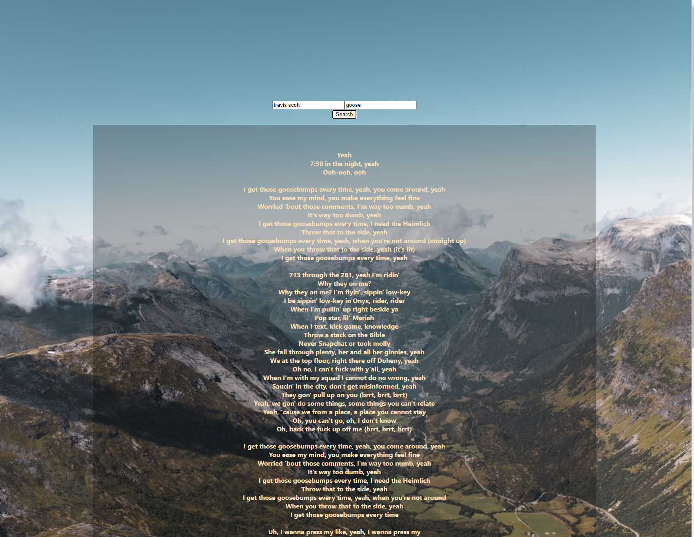

# lyrics api and client

Access server/api hosted on Heroku [here](https://se-lyrics.herokuapp.com/lyrics)

simple api for lyrics with client to consume, made because I wanted to
grab lyrics and had an error with cors so needed to set a server up and fetch the request there
where I can send it to the frontend(client)

For a sample simple server checkout my repo [here](https://github.com/elsowiny/ExpressServerTemplate).

